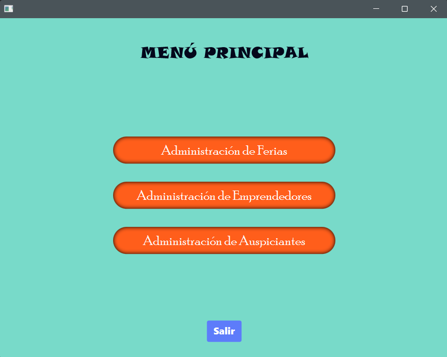
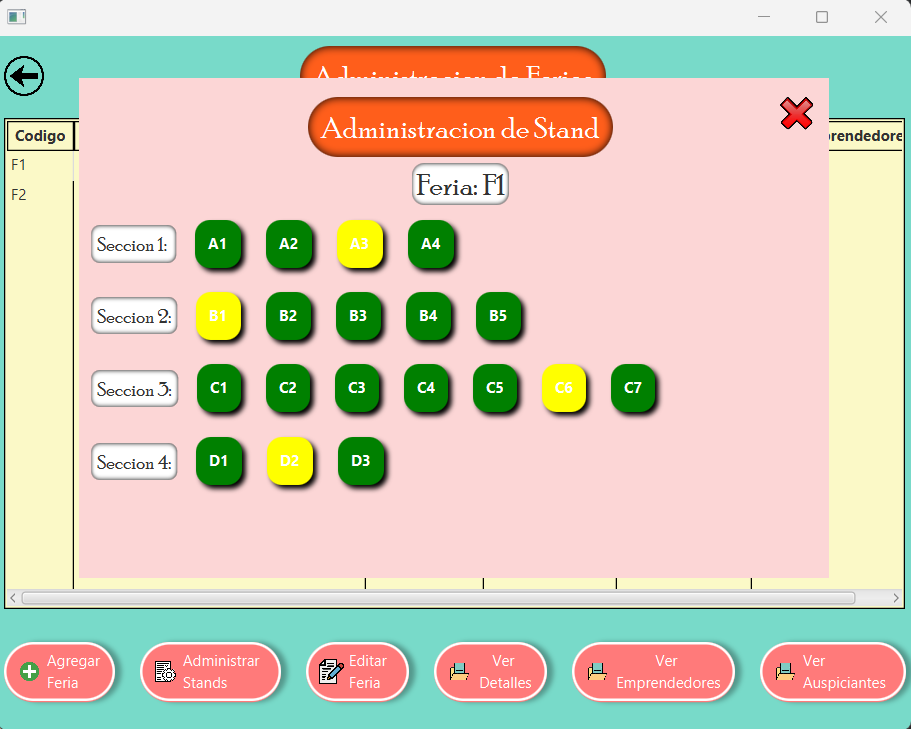
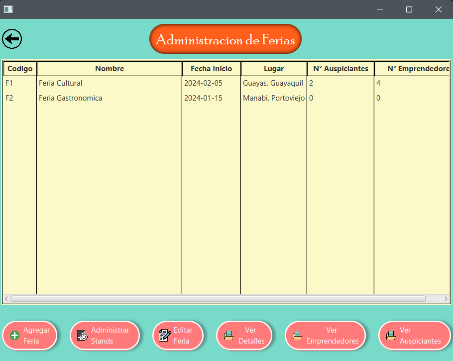

## General
Hola, este sitio funciona como un portafolio personal en línea donde podrás encontrar información sobre mí en cuanto a datos personales, proyectos desarrollados y tecnologías aprendidas en el desarrollo de software. Este sitio se mantiene con fines académicos y profesionales.
## Contenido 
* [Información personal](#información-personal) 
* [Proyectos](#proyectos) 
* [Tecnologías](#tecnologías) 
## Información personal 
* Nombre: Barzola De La O Steven Ariel
* Ocupación: Estudiante
* Institución: Escuela Superior Politécnica del Litoral
* Correo institucional: starbarz@espol.edu.ec
* Nacionalidad: Ecuatoriana
## Proyectos 
* Proyecto 1: [POO-P3-G03](https://github.com/StevenBarzola/POO-P3-G03.git)

* Proyecto 2: [ED-PAO1-2024-P1-6](https://github.com/lolothens-e/ED-PAO1-2024-P1-6.git)

* Proyecto 3: [ED-PAO1-2024-P2-6](https://github.com/lolothens-e/ED-PAO1-2024-P2-6.git)
## Tecnologías 
* [Lista de tus intereses]
