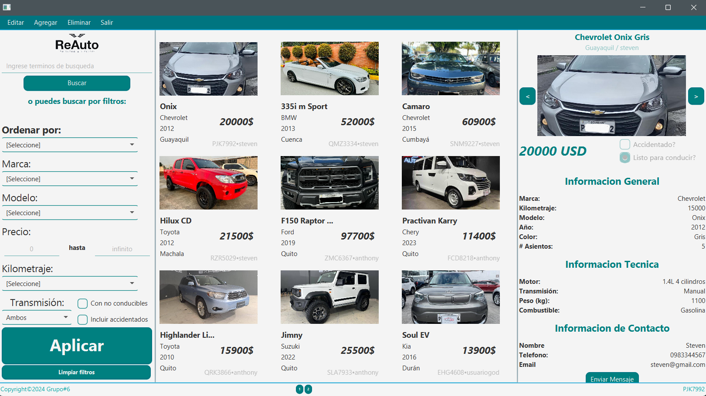
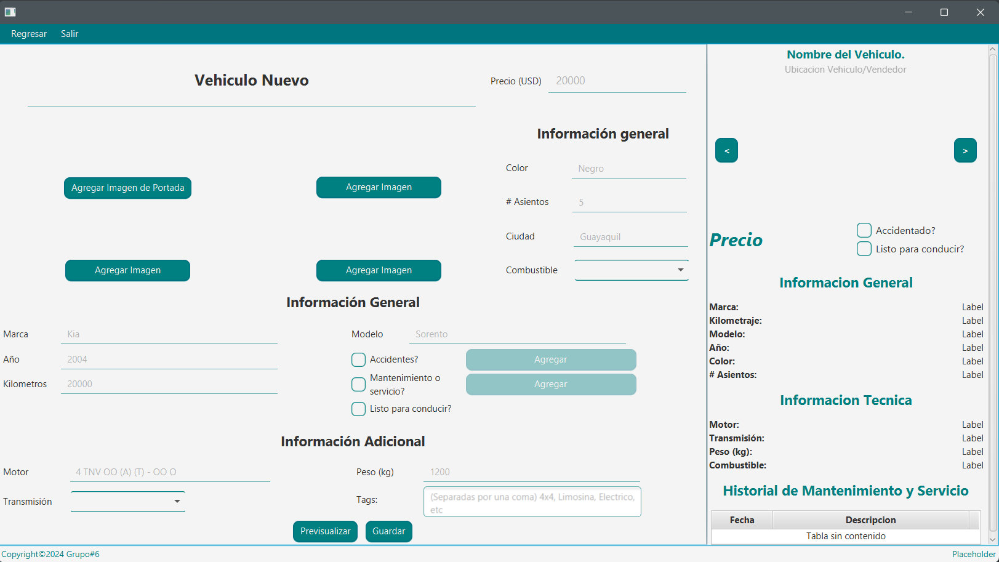
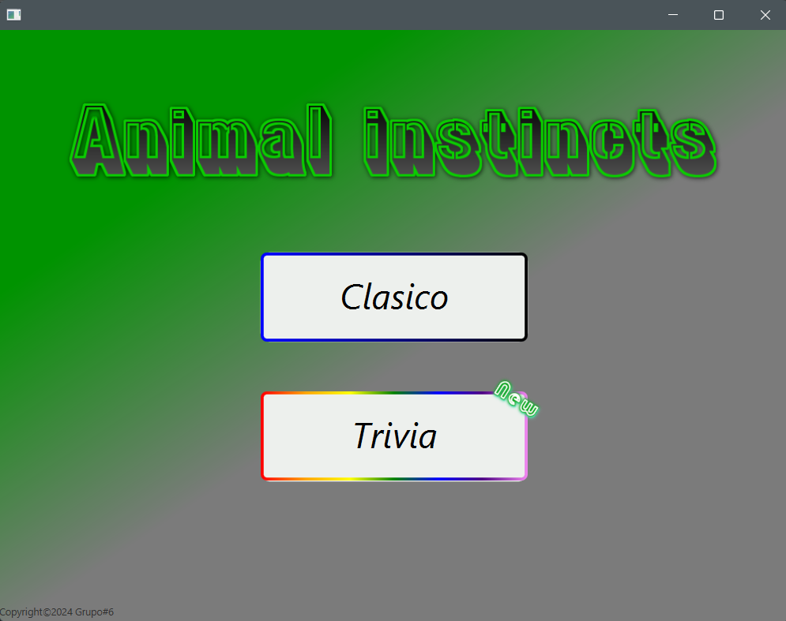
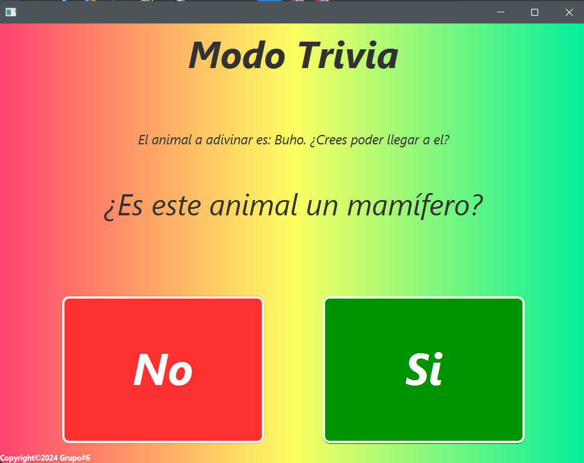

## General
Hola, este sitio funciona como un portafolio personal en línea donde podrás encontrar información sobre mí en cuanto a datos personales, proyectos desarrollados y tecnologías aprendidas en el desarrollo de software. Este sitio se mantiene con fines académicos y profesionales.
## Contenido 
* [Información personal](#información-personal) 
* [Proyectos](#proyectos) 
* [Tecnologías](#tecnologías) 
## Información personal 
* Nombre: Barzola De La O Steven Ariel
* Ocupación: Estudiante
* Institución: Escuela Superior Politécnica del Litoral
* Correo institucional: starbarz@espol.edu.ec
* Nacionalidad: Ecuatoriana
## Proyectos 
* __Manejo de Ferias:__ [POO-P3-G03](https://github.com/StevenBarzola/POO-P3-G03.git)  
  __Descripción ->__ Aplicación para el manejo de ferias locales junto a emprendedores y auspiciantes (simulación). Con fines académicos para el curso Programación Orientada a Objetos.  
  __Tecnologías ->__ Java y JavaFX (Apache NetBeans IDE 19), y Scene Builder.  
  __Funcionalidades ->__ Manejo de ferías que se desarrollarán  ; Manejo de emprendedores y auspiciantes que participarán en las ferias.

* __ReAuto:__ [ED-PAO1-2024-P1-6](https://github.com/lolothens-e/ED-PAO1-2024-P1-6.git)  
  __Descripción ->__ Simulación de una plataforma para la compra y venta de vehículos usados en Ecuador. Con fines académicos para el curso Estructura de Datos.  
  __Tecnologías ->__ Java y JavaFX (Apache NetBeans IDE 19), y Scene Builder.  
  __Funcionalidades ->__ Agregación y eliminación de vehículos (solo motos y autos) para la venta o compra de estos respectivamente ; Filtro de búsquedas ; Sistema de login.

* __Animal Instincts:__ [ED-PAO1-2024-P2-6](https://github.com/lolothens-e/ED-PAO1-2024-P2-6.git)  
  __Descripción ->__ Aplicación recreativa sobre adivinar un animal en base a sus características a través del uso de árboles binarios. Con fines académicos para el curso Estructura de Datos.   
  __Tecnologías ->__ Java y JavaFX (Apache NetBeans IDE 19), y Scene Builder.  
  __Funcionalidades ->__ Dos modos de juegos diferentes, en el modo clásico la computadora debe adivinar el animal, mientras que en la trivia es el usuario quien pone a prueba sus conocimientos sobre lo que sabe   del animal) ; Retroalimentación de resultados durantes y después del juego.  

## Tecnologías 
Lenguajes de programación, frameworks, librerías y otras herramientas aprendidas:  
* __Lenguajes de Programación:__ Java (lenguaje más usado), Python y C.  
* __Frameworks/librerías:__ Numpy (python), JavaFX (Java).  
* __Plataformas/IDE:__ GitHub, Figma, Eclipse, NetBeans, SceneBuilder, Visual Paradigm, MySQL, PyCharm Community.

